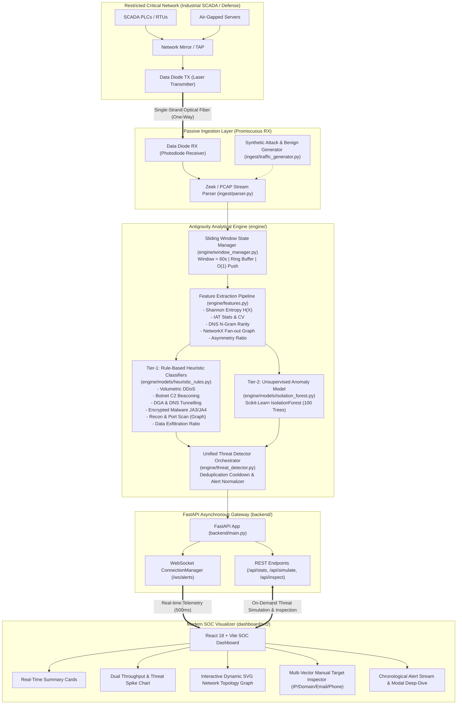
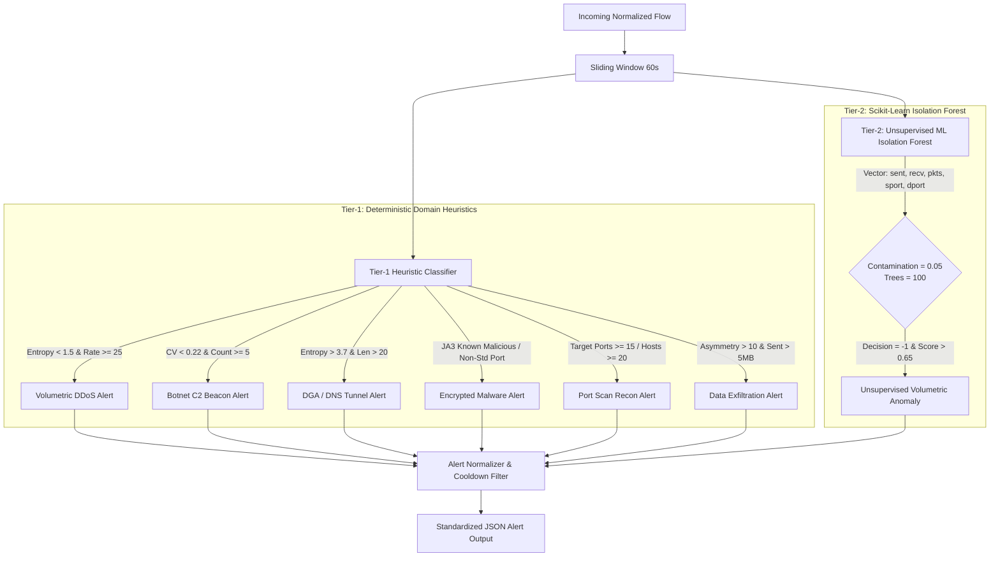

# System Architecture & Technical Specification (ARCHITECTUR.md)

**System Name:** AI-Based Cyber Threat Detection in Unidirectional IP Traffic  
**Hardware Profile:** Physical Data Diode / Air-Gapped Optical Interface  
**Version:** 1.2.0  
**Language Stack:** Python 3.10+, FastAPI, React 18, Vite, Tailwind CSS, Scikit-Learn, NetworkX  

---

## 1. End-to-End System Architecture

The architecture decouples network ingestion, stateful sliding-window buffering, mathematical feature extraction, threat classification, and telemetry dispatching into isolated, non-blocking pipelines.



---

## 2. Component Breakdown & Directory Structure

```
Cyber-Threat/
├── ingest/                           # Ingestion & Traffic Simulation Layer
│   ├── __init__.py
│   ├── parser.py                     # Zeek conn.log / dns.log / ssl.log & Scapy PCAP normalizer
│   └── traffic_generator.py          # Synthetic benign background & multi-vector threat injector
├── engine/                           # Threat Analytics & Machine Learning Engine
│   ├── __init__.py
│   ├── window_manager.py             # Thread-safe sliding window buffer (O(1) push, auto-prune)
│   ├── features.py                   # Mathematical & statistical feature extraction algorithms
│   ├── threat_detector.py            # Master orchestration, deduplication cooldown & alert schema
│   └── models/
│       ├── __init__.py
│       ├── heuristic_rules.py        # Domain-specific classifiers for 6 primary threat vectors
│       └── isolation_forest.py       # Scikit-Learn unsupervised multi-variate anomaly detector
├── backend/                          # FastAPI REST & Real-Time WebSocket Streaming Server
│   ├── __init__.py
│   ├── main.py                       # HTTP routing, WebSocket manager, manual inspection engine
│   ├── config.py                     # Global runtime constants and thresholds
│   └── requirements.txt              # Production Python package requirements
├── dashboard/                        # Modern SOC Analyst Frontend (React + Vite + Tailwind CSS)
│   ├── package.json
│   ├── vite.config.js
│   ├── tailwind.config.js
│   ├── index.html
│   └── src/
│       ├── App.jsx                   # Central state orchestrator & WebSocket consumer
│       ├── index.css                 # Cyber-command theme tokens & glassmorphism utilities
│       └── components/
│           ├── Header.jsx            # Live system status, diode indicator & mode controls
│           ├── SummaryCards.jsx      # KPI cards (Throughput, Alerts, Confidence, Latency)
│           ├── ManualInspectionPanel.jsx # Multi-vector manual threat scanner
│           ├── SimulationControl.jsx # Synthetic attack scenario trigger buttons
│           ├── ThroughputChart.jsx   # Dual-axis real-time line/area chart (pps, bps, alert spikes)
│           ├── NetworkTopologyGraph.jsx # Dynamic SVG graph of active threat hosts and targets
│           ├── AlertFeed.jsx         # Live alert stream with severity filtering and badges
│           └── ThreatDetailsModal.jsx # Forensic evidence inspector with plain-English toggle
```

---

## 3. Data Ingestion & Physical Diode Layer

### 3.1 Hardware Diode Interface
The physical connection uses an ST or LC optical connector with the transmit (TX) fiber physically cut or disconnected at the receiver end. The network interface card (NIC) on the detection host runs in **promiscuous receive-only mode** with ARP, ICMP, and TCP transmissions disabled at the Linux kernel level:

```bash
# Operating System Hardening for Receive-Only Diode Interface
sysctl -w net.ipv4.conf.all.arp_ignore=8
sysctl -w net.ipv4.conf.all.arp_announce=2
sysctl -w net.ipv4.icmp_echo_ignore_all=1
ip link set eth1 promisc on arp off
```

### 3.2 Ingestion Flow Normalization
The ingestion pipeline converts disparate network logs (Zeek `conn.log`, `dns.log`, `ssl.log`) or raw PCAP frames into a unified, lightweight internal flow dictionary:

```python
{
    "timestamp": 1726821845.12,
    "flow_identifier": {
        "src_ip": "192.168.10.45",
        "src_port": 54321,
        "dst_ip": "45.142.214.8",
        "dst_port": 443,
        "protocol": "TCP",
        "src_label": "Workstation-04",
        "dst_label": "External-Host"
    },
    "bytes_sent": 520,
    "bytes_received": 2480,
    "packet_count": 10,
    "duration_seconds": 1.25,
    "tcp_flags": "S",
    "dns": {
        "query": "c2-command.evil-corp.net",
        "qtype": "A",
        "rcode": 0
    },
    "tls": {
        "sni": "c2-command.evil-corp.net",
        "ja3": "a0e42d24b9c7c4b0959f676e939da290",
        "ja4": "t13d1516h2_8daaf6152771_0123456789ab"
    }
}
```

---

## 4. Sliding Window State Management

Real-time threat detection in high-volume environments requires continuous tracking over time windows without unbounded memory expansion.

### 4.1 Bounded Sliding Window Architecture (`engine/window_manager.py`)
- **Window Duration ($W$):** Configured to $60.0$ seconds by default.
- **Data Structure:** High-performance Python `collections.deque` supporting $O(1)$ appends and $O(1)$ left-pops.
- **Pruning Strategy:** On each flow insertion, stale entries where $t_{current} - t_{flow} > W$ are evicted from the head of the deque.
- **Secondary Indexing:** An in-memory hash map `src_ip_index: Dict[str, deque]` provides instantaneous lookups for all active flows belonging to a specific source IP without scanning the entire window buffer.

```python
def add_flow(self, flow: Dict[str, Any]):
    current_time = flow.get('timestamp', time.time())
    self.flows.append(flow)
    self._prune_stale_flows(current_time)

def _prune_stale_flows(self, current_time: float):
    cutoff = current_time - self.window_size
    while self.flows and self.flows[0].get('timestamp', 0) < cutoff:
        self.flows.popleft()
```

---

## 5. Mathematical Feature Engineering Pipeline (`engine/features.py`)

The pipeline extracts five mathematical features designed to expose covert and volumetric attacks across encrypted, unidirectional traffic:

### 5.1 Shannon Entropy on Source IP Distribution and DNS Query Strings
Measures information randomness:
$$\mathcal{H}(X) = -\sum_{i=1}^{n} P(x_i) \log_2 P(x_i)$$

- **DDoS Application:** During normal traffic, source IPs exhibit high entropy ($\mathcal{H} > 3.0$). In volumetric single-source or concentrated SYN flood attacks, entropy collapses to $\mathcal{H} < 1.5$.
- **DNS / DGA Application:** Legitimate English domains (e.g., `google.com`, `apple.com`) have an entropy of $\approx 2.1 - 2.8$. Algorithmic DGA domains (e.g., `x9z8q7w6y5v4u3t2.biz`) exhibit high randomness with $\mathcal{H} > 3.7$.

### 5.2 Inter-Arrival Time (IAT) Statistics & Coefficient of Variation ($CV$)
Given sorted packet/flow timestamps $\{t_1, t_2, \dots, t_k\}$, inter-arrival times are $\Delta t_i = t_{i} - t_{i-1}$.
$$\mu_{\text{IAT}} = \frac{1}{k-1} \sum_{i=2}^{k} \Delta t_i, \quad \sigma_{\text{IAT}} = \sqrt{\frac{1}{k-1} \sum_{i=2}^{k} (\Delta t_i - \mu_{\text{IAT}})^2}$$
$$CV = \frac{\sigma_{\text{IAT}}}{\mu_{\text{IAT}}}$$
- **Botnet C2 Beaconing Application:** Human and benign web traffic exhibits bursty, non-deterministic arrival times ($CV > 0.80$). Automated malware beaconing (e.g., Cobalt Strike or TrickBot heartbeats) executes on tight sleep timers, resulting in near-zero standard deviation and $CV < 0.22$.

### 5.3 Bi-Gram & Tri-Gram Rarity Scoring
To catch DGA domains that intentionally manipulate character frequencies to evade raw entropy filters:
$$\text{Rarity} = 1.0 - \left( \frac{\sum_{j=1}^{m-1} \mathbb{I}(\text{bigram}_j \in \mathcal{D}_{\text{common}})}{m - 1} \right)$$
Where $\mathcal{D}_{\text{common}}$ represents the corpus of 40 most frequent English bigrams (`th`, `he`, `in`, `er`, `an`, etc.). Rarity scores $> 0.65$ combined with length $> 16$ denote synthetic generation.

### 5.4 Graph Fan-Out Topology Metrics (NetworkX)
Builds a directed interaction graph $G = (V, E)$ over the active sliding window:
- Vertices $V$: Unique source and destination IP addresses.
- Directed Edges $E$: Communication channels labeled with destination port numbers: $e = (v_{\text{src}}, v_{\text{dst}}, p_{\text{dst}})$.
- **Metrics Calculated:**
  - $\text{Out-Degree}(v_{\text{src}})$: Total directed interaction count.
  - $|\mathcal{N}_{\text{dst}}(v_{\text{src}})|$: Unique destination IPs contacted.
  - $|\mathcal{P}_{\text{dst}}(v_{\text{src}})|$: Unique destination ports probed.
- **Port Scan Application:** If $|\mathcal{P}_{\text{dst}}| \ge 15$ or $|\mathcal{N}_{\text{dst}}| \ge 20$ within $W = 60\text{s}$, reconnaissance activity is confirmed with high confidence.

### 5.5 Byte Asymmetry Ratio
$$R_{\text{asym}} = \frac{\text{bytes\_sent}}{\text{bytes\_received} + 1.0}$$
- **Data Exfiltration Application:** In standard browsing or telemetry, clients receive more data than they send ($R_{\text{asym}} \ll 1.0$). Data exfiltration triggers large outbound data bursts with $R_{\text{asym}} > 10.0$ and $\text{bytes\_sent} > 5.0\text{ MB}$.

---

## 6. Threat Detection Tiering



### 6.1 Alert Deduplication & Cooldown Logic
To prevent overwhelming analysts during continuous bursts, the engine enforces an entity-keyed cooldown cache:
$$\text{Key} = \text{ThreatClass} : \text{EntityIdentifier}$$
Subsequent alerts matching the same key within $3.0\text{ seconds}$ are suppressed while underlying flow statistics continue to increment.

---

## 7. Backend API & WebSocket Architecture (`backend/main.py`)

FastAPI coordinates synchronous REST administrative endpoints with high-concurrency asynchronous WebSocket broadcasting.

### 7.1 WebSocket Architecture (`/ws/alerts`)
- Managed by `ConnectionManager`, which stores a thread-safe list of active WebSocket connections.
- When an alert is detected or telemetry ticks every $500\text{ ms}$, the message is serialized to JSON and broadcast concurrently using `asyncio.gather()`.
- Automatically drops disconnected sockets without blocking other active subscribers.

### 7.2 Core Endpoints

| Method | Route | Description |
| :--- | :--- | :--- |
| `GET` | `/api/health` | Verifies service health, diode mode, and auto-detection status. |
| `GET` | `/api/stats` | Returns current packets per second (pps), bits per second (bps), and alert counts. |
| `GET` | `/api/alerts` | Fetches full historical log of detected threat alerts. |
| `POST` | `/api/alerts/clear` | Flushes alert history and clears cooldown caches. |
| `POST` | `/api/detection/toggle` | Enables or pauses real-time heuristic and ML evaluation. |
| `POST` | `/api/simulate/{threat_type}` | Injects synthetic multi-flow threat sequences for testing. |
| `POST` | `/api/inspect` | Evaluates target IP, URL, email address, or phone number against threat intelligence. |
| `WS` | `/ws/alerts` | Real-time bi-directional telemetry and alert stream. |

---

## 8. Frontend SOC Visualizer Architecture (`dashboard/`)

The user interface is built as a single-page reactive application using React 18 and Tailwind CSS, styled to emulate an air-gapped critical infrastructure SOC display:

```
[ Header: Diode Status | Auto-Detection Toggle | Clear Alerts | Guide Modal ]
[ Welcome & Context Banner: Plain-English Operational Summary ]
[ Summary Cards: Live Throughput (pps/bps) | Total Alerts | Peak Confidence | Processing Latency ]
[ Manual Target Inspector: IP Address | Website URL | Email Address | Phone Number ]
[ Simulation Bar: 6 Interactive Attack Trigger Buttons ]
[ Throughput & Threat Spike Chart: Recharts Dual-Axis Stream ]
[ Dynamic Network Topology Graph: SVG-Rendered Host Nodes, Edges & Threat Pulses ]
[ Alert Stream Feed: Interactive Chronological Feed & Forensic Deep-Dive Modal ]
```

### 8.1 Performance Optimizations
- **Data Pruning:** The line chart maintains only the last $25$ time ticks, preventing memory leaks in prolonged SOC shifts.
- **Lightweight SVG Topology:** The network topology renders pure declarative SVG elements without heavy 3D WebGL overhead, ensuring compatibility with rugged industrial thin clients.
- **Debounced Inspection:** Manual threat inspection executes asynchronously with instant client feedback.
